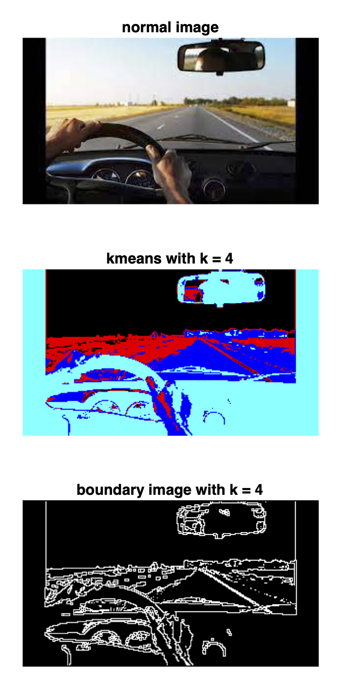

# Image clustering

This repository contains a MATLAB implementation to segment an image into regions using [k-means clustering](https://en.wikipedia.org/wiki/K-means_clustering)
to group pixels. Given a height x width x 3 matrix, we apply k-means clustering to associate pixels with clusters.
To detect cluster boundary pixels, I have also implemented the script [boundaryPixels.m](boundaryPixels.m).
Below you can see the result of the kmeans algorithm (second image) and the boundary pixel algorithm (third image).
  

   

